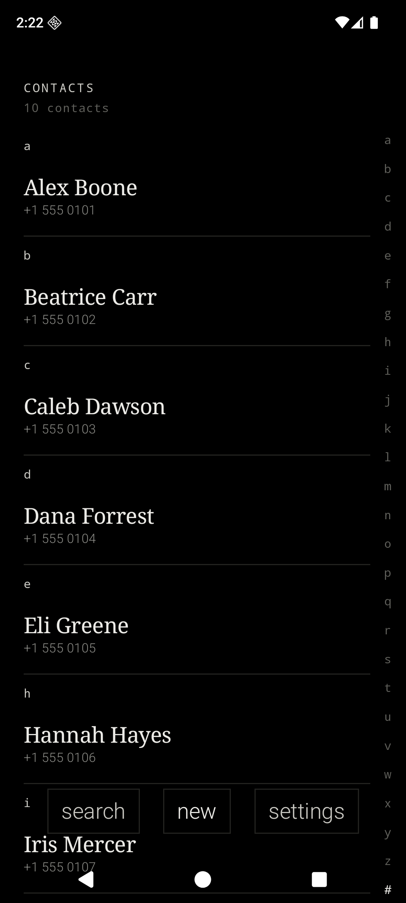
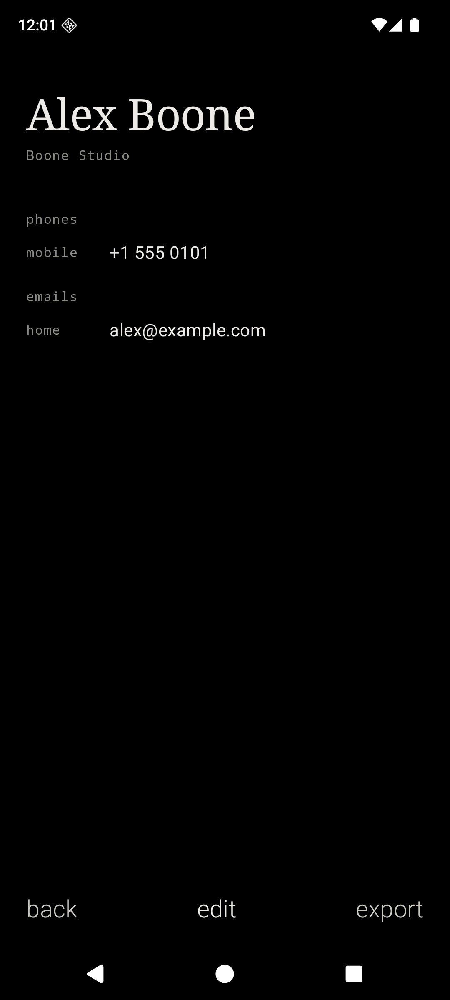
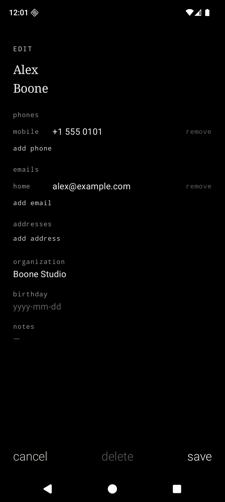
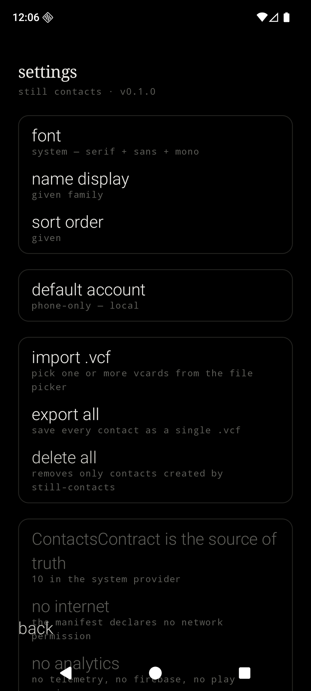

<div align="center">

# Still Contacts

#### A local-only contacts app that never asks you to sign in.

part of the [still](STILL.md) family. the pact governs every line of code in this repo.

<br>

&nbsp;&nbsp;&nbsp;

<br>

</div>

---

Still Contacts is a minimalist, privacy-first Android contacts app. It is monochrome, OLED-first, text-first, and the fourth member of the Still ecosystem after [Still](../still-launcher), [Still Notes](../still-notes), and [Still Cal](../still-cal). Same temperament, same fonts, same refusal to phone home — and the long-awaited bridge to a future `still-dial` / `still-sms`.

It declares no internet permission. It ships no analytics. It depends on neither Firebase nor Google Play Services. The vCard parser is hand-written; there is no third-party CardDAV or vCard library. It runs on any Android device from API 26 up.

## What Still Contacts does

- An **alphabetical contacts list** as the home screen, every contact in the system provider, each row showing the display name in serif and the primary phone (or email, if no phone) in mono caption beneath.
- A **letter rail** down the right edge, `a` through `z` plus `#`. Tap to snap; drag to scrub.
- A **sticky letter header** that pins to the top of the list as you scroll past each section.
- An **inline search** triggered by `search`, filtering by display name, phone substring, and email substring, case-insensitive.
- A **detail view** with typed rows — phones, emails, addresses, organization, birthday, notes — and tap-actions: phone fires `ACTION_DIAL`, email fires `ACTION_SENDTO`, address fires `ACTION_VIEW` with `geo:`.
- An **edit view** that is the same shape as detail, with `BasicTextField`s and tap-to-cycle type labels (`mobile` → `home` → `work` → `other`). Add a row via the `add phone` / `add email` / `add address` lowercase verbs at the end of each section.
- A **`new` footer verb** rather than a `+` button.
- **Import** vCard files via SAF (`OpenMultipleDocuments` for `text/vcard`, `text/x-vcard`, `text/plain`, `application/octet-stream`).
- **Single-contact export** as `<safe-display-name>.vcf` via SAF.
- **Bulk export** of every contact as a single `still-contacts-<timestamp>.vcf` via SAF.
- **System share-in** via `ACTION_VIEW` for `text/vcard` and `text/x-vcard`.
- **System pick** via `ACTION_PICK` for `vnd.android.cursor.dir/contact` — other apps can ask Still Contacts to pick a contact and receive its `lookupKey` URI.
- Font presets shared with the rest of the ecosystem: **System**, **Editorial**, **Terminal**, **Grotesk**.
- **Name display order** (`given family` / `family, given` / system) and **sort order** (`given` / `family`) are setting toggles.
- A **`delete all`** in settings that only removes contacts created by Still Contacts itself (identified by the `RawContacts.SOURCE_ID = "still-contacts"` sentinel).

## What Still Contacts refuses to do (and what it asks for honestly)

| Refused / asked | Why |
| --- | --- |
| `INTERNET` permission | Refused. The app has no networking dependency. |
| `GET_ACCOUNTS` permission | Refused. There is no per-contact account picker and no account creation flow. Settings can choose the default writable account from provider-visible accounts; new contacts use that default. |
| `CALL_PHONE` permission | Refused. Tapping a phone number fires `ACTION_DIAL`; the user's chosen dialer places the actual call. Still Contacts is never the thing that calls. |
| Media / photo permissions | Refused. v0.1 has no contact photos — neither read nor write nor display. |
| CardDAV, Google Contacts sync, Exchange | Refused. No account-add flow of any kind. |
| Third-party vCard library | Refused. The parser lives in `dev.chuds.stillcontacts.vcard`, hand-written. |
| Merge duplicates, fuzzy match, "are these the same person" | Refused. Manual merging only. |
| Favorites, starred, groups, labels | Refused. The OS dialer's own favorites and groups exist; we don't replicate them. |
| Cloud backup | Refused. `data_extraction_rules.xml` excludes everything. The plaintext `.vcf` SAF export is the entire backup story. |
| Widgets, app shortcuts, quick-settings tiles, foreground services | Refused. The app does nothing while it is closed. |
| **`READ_CONTACTS`** | **Asked, honestly.** Required to query the system provider for the list and detail screens. Asked at runtime on first launch. |
| **`WRITE_CONTACTS`** | **Asked, honestly.** Required to apply `ContentProviderOperation` batches to create, edit, and delete contacts. Asked at runtime the first time the user taps `new`, `save`, or `delete`. |

Neither permission involves the network. Neither pulls a third-party SDK.

## Why ContactsContract instead of files-on-disk

Still Notes stores notes as `.md` files in `filesDir/`. Still Cal stores events as `.ics` files in `filesDir/`. Still Contacts can't follow that pattern: a future `still-dial` / `still-sms` (and the user's existing dialer / SMS app today) needs to resolve incoming numbers against names, and Android exposes exactly one mechanism for that — the system `ContactsContract` provider. If Still Contacts stored its data anywhere else, the user's phone would ring with a bare number every time someone called.

The pact is honored differently here. **Plaintext export forever** is the load-bearing promise: bulk export of every contact as a single `.vcf` file via SAF is something the user can `cat`, drop into another contacts app, or archive. The app dying does not strand the user.

## Privacy posture, in code

| File | What it guarantees |
| --- | --- |
| `app/src/main/AndroidManifest.xml` | Exactly two permissions declared (`READ_CONTACTS`, `WRITE_CONTACTS`); no `INTERNET`, `GET_ACCOUNTS`, `CALL_PHONE`, or media permissions. Two intent-filters: `VIEW` for `text/vcard` and `PICK` for `vnd.android.cursor.dir/contact`. |
| `app/src/main/res/xml/data_extraction_rules.xml` | Excludes every sharedpref / file / database domain from cloud backup and device transfer. |
| `app/build.gradle.kts` | Dependencies only on AndroidX, Compose, and DataStore — no Firebase, no GMS, no analytics SDK, no CardDAV library, no vCard library. |
| `app/src/main/java/dev/chuds/stillcontacts/data/ContactsRepository.kt` | All `RawContacts` rows the app inserts carry `SOURCE_ID = "still-contacts"`; `delete all` only deletes rows that carry the sentinel. |
| `app/src/main/java/dev/chuds/stillcontacts/vcard/` | Hand-rolled vCard 3.0 reader / writer; no third-party parser. |

## Architecture

```text
MainActivity
└── StillContactsApp                          single-Activity Compose shell, hand-rolled router
    ├── ContactsRepository                    ContentResolver bridge, ContentObserver-backed Flow,
    │                                         applyBatch transactions, SOURCE_ID source-stamp
    ├── PreferencesRepository                 DataStore — font preset, name display order, sort
    │                                         order, default writable account
    ├── IoActions                              SAF read/write, single + bulk .vcf export, share-in
    ├── vcard
    │   ├── VCardLexer                         line unfolding (RFC 6350)
    │   ├── VCardParser                        BEGIN/END block recognition → RawVCard triples
    │   ├── VCardTypes                         RawVCard → ContactDetail (FN/N/TEL/EMAIL/ADR/ORG/NOTE/BDAY)
    │   └── VCardWriter                        ContactDetail → vCard 3.0, line folding, escaping
    └── Compose surfaces
        ├── ContactsListScreen                 alphabetical list, letter rail, sticky headers, search
        ├── ContactDetailScreen                typed rows, tap-actions for tel:/mailto:/geo:
        ├── ContactEditScreen                  single scrollable form, tap-to-cycle types
        ├── SettingsScreen                     font, name order, sort, default account, import/export
        └── ui/components                      StillDivider, StillMenuItem, StillSectionCard,
                                               StillLetterRail
```

Kotlin, Jetpack Compose, AGP 9.2.1, Gradle Kotlin DSL. The repository owns every `ContentResolver` call; the Compose layer never touches a cursor. Edit is implemented as "delete all `Data` rows for the `RawContact` then insert from the edited form" inside one `applyBatch` — atomic, simple, easy to audit. Hard delete uses `CALLER_IS_SYNCADAPTER=true` so the row does not become a tombstone.

## Gestures

| Gesture | Effect |
| --- | --- |
| Tap a contact row | Open detail |
| Long-press a contact row | Action sheet — open, edit, export, delete |
| Tap a letter in the right rail | Snap to that section |
| Drag down the letter rail | Continuous scrub through the list |
| Tap `search` | Reveal inline search field |
| Tap a phone row in detail | Fire `ACTION_DIAL` |
| Tap an email row in detail | Fire `ACTION_SENDTO` |
| Tap an address row in detail | Fire `ACTION_VIEW` with `geo:` |
| Tap a type label in edit | Cycle `mobile` → `home` → `work` → `other` |
| Tap `add phone` / `add email` / `add address` | Append a blank typed row |
| System back | One step back along the route stack |

## Design language

- OLED black background. Soft white primary text. Gray secondary text. Hairline (`#232320`) dividers.
- Serif for the contact display name and list-row titles. Sans-serif for body text and edit fields. Monospace for kickers, captions, type labels, the letter rail, and section letter headers.
- Lowercase for verbs (`new`, `save`, `delete`, `cancel`, `back`, `search`, `import`, `export`, `add phone`, `add email`, `add address`, `remove`). Title case only for things the user typed (a person's name).
- No ripple. Fade-only transitions. No bouncy motion, no colorful accents.
- All four font presets ship — System, Editorial, Terminal, Grotesk — same as every other Still app.

## Build and install

Requirements: **JDK 17**, the **Android SDK** with `platforms;android-36` and `build-tools;36.0.0`. The Gradle wrapper (9.4.1) is bundled.

```bash
./gradlew assembleDebug
adb install -r app/build/outputs/apk/debug/app-debug.apk
```

The app appears as **still contacts** in the launcher.

## Notes for GrapheneOS

Still Contacts depends on no part of Google Play Services and declares only `READ_CONTACTS` and `WRITE_CONTACTS`, so it runs cleanly on a fresh GrapheneOS profile. The contacts provider is OS-resident; on GrapheneOS the local "Phone-only" account is the default writable target unless the user has added another.

## Status

MVP. Builds against AGP 9.2.1 / Kotlin 2.3.21 / `compileSdk 36`. Verified to compile via `./gradlew assembleDebug`. The vCard round-trip (write → parse → equality) is covered by a JVM unit test in `app/src/test/`. Emulator verification of every checkbox in `spec.md` §13 is the next step.

## License

MIT. See [`LICENSE`](LICENSE).
